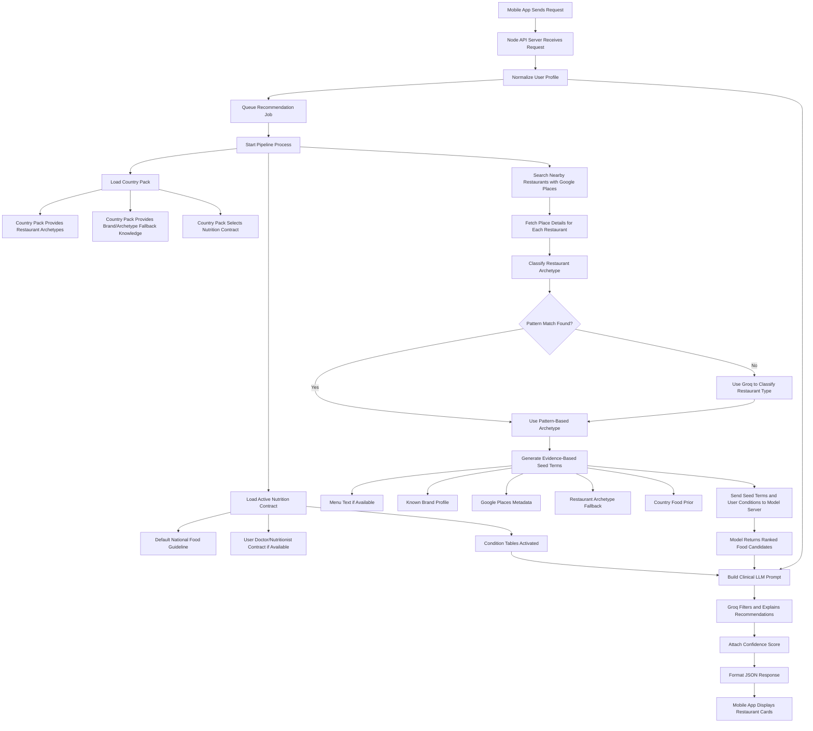

# Nutrifence End-to-End Recommendation Flow

## Case Study User

This flow explains what happens when the backend generates restaurant meal recommendations for one user.

Example user:

- Name used in case study: Mr Thomas
- Age: 30 years
- Gender: Male
- Health condition: Diabetes
- Dietary restriction: Low sugar
- Location: supplied by the mobile app from GPS or a selected map point
- Country: Nigeria or Canada, depending on request country or inferred coordinates

The goal is to explain how the system moves from user location to clinically filtered restaurant recommendations.

## Corrected High-Level Explanation

The system does not begin by asking AI to randomly recommend food. It begins with the user's location. The backend searches for restaurants around that location, classifies each restaurant into a country-specific restaurant type, then generates evidence-based seed terms from restaurant evidence. These seed terms come from the strongest available evidence: menu text where available, known brand profiles, Google Places metadata, restaurant archetype, and country food priors. The seed terms are passed into the recommendation model, and the user's health profile and nutrition contract are then used to filter and explain the final result.

For Mr Thomas, because he is diabetic, the final filtering step should avoid meals that are likely to cause blood sugar spikes, such as sugary drinks, high-sugar desserts, refined carbohydrate-heavy meals without fibre/protein balance, and large portions of high-glycaemic foods.

## Flow Diagram



## Step 1: Mobile App Sends The Request

The mobile app sends the user's location and profile to the backend.

Example request for Mr Thomas:

```json
{
  "lat": 6.4698,
  "lng": 3.5852,
  "radius": 1500,
  "country": "NG",
  "maxRestaurants": 5,
  "userId": "thomas_001",
  "userProfile": {
    "age": 30,
    "gender": "male",
    "conditions": ["diabetes"],
    "restrictions": ["low sugar"],
    "allergies": []
  }
}
```

The key inputs are the location, radius, country, user profile, and user ID. The user ID allows the backend to load any saved doctor/nutritionist report for that user.

## Step 2: API Server Normalizes The User Profile

Before the pipeline starts, the API server cleans and standardizes the user profile.

Examples:

- `gender` is normalized to `male` or `female`.
- allergies may be submitted as comma-separated text and converted into an array.
- conditions such as `diabetic`, `blood sugar`, or `type 2 diabetes` can be normalized to `diabetes`.
- restrictions such as `low sugar` remain available for the final filtering prompt.

For Mr Thomas, the active normalized condition becomes:

```text
diabetes
```

This matters because the diabetes condition activates diabetes-specific nutrition rules from the nutrition contract.

## Step 3: The Request Enters The Recommendation Queue

The API server supports multiple incoming users by placing recommendation requests into a queue. This avoids the earlier `pipelineBusy` problem where a second user could fail immediately while the first user's pipeline was still running.

The queue does not mean all jobs run at the exact same time. It means users can submit requests while another request is processing, and the backend handles them in order instead of crashing or rejecting them unnecessarily.

This is important because the pipeline calls external services such as Google Places and Groq. Running too many full recommendation pipelines at once can cause rate limits, timeout problems, and unstable results.

## Step 4: Backend Loads The Correct Country Pack

The system supports country-specific recommendation behaviour through country packs.

A country pack defines:

- restaurant archetypes for that country;
- brand and archetype fallback knowledge for seed generation;
- pattern rules for classifying restaurants;
- the national nutrition contract to use;
- the model mode for that country.

For Nigeria, examples of restaurant archetypes include Nigerian fast food, local canteen/buka, suya grill, pepper soup joint, seafood joint, shawarma/pizza restaurant, fine dining Nigerian restaurant, and unknown Nigerian restaurant.

For Canada, examples include Canadian fast food, coffee/bakery, casual dining, pizza, burger/grill, Asian Canadian, Middle Eastern Canadian, Indian Canadian, healthy bowl/salad, seafood, and breakfast/brunch.

This makes the same backend pipeline work for both Nigeria and Canada while using different food assumptions and dietary guideline contracts.

## Step 5: Backend Loads The Nutrition Contract

The nutrition contract is the authority layer used to control the final recommendation. It is not just a plain text prompt; it is a structured rule set.

The contract has three layers:

1. National baseline guidance
2. Condition-specific tables
3. User-specific doctor/nutritionist report, if available

For Nigeria, the baseline is the Nigerian Food-Based Dietary Guidelines.

For Canada, the baseline is Canada's Food Guide.

For Mr Thomas, because he has diabetes, the diabetes table is activated. This table influences the final advice by pushing the system to reduce high-sugar foods, avoid sugary drinks, avoid excessive refined carbohydrates, prefer meals with vegetables, fibre, and lean protein, and control portions of carbohydrate-heavy meals.

If Mr Thomas has uploaded a doctor/nutritionist meal plan before, the system loads that user-specific contract from storage and applies it on top of the national guideline.

## Step 6: Backend Searches Nearby Restaurants

The pipeline uses Google Places to search for restaurants within the requested radius.

For example, if Mr Thomas is in Ajah, Lagos, and the radius is 1500 metres, the backend asks Google Places for restaurants around that coordinate.

The system receives restaurant records such as restaurant name, Google place ID, address, latitude and longitude, rating, price level if available, opening status if available, and website if available.

The backend then removes duplicate restaurants and limits the number of restaurants based on `maxRestaurants`.

## Step 7: Backend Fetches Full Restaurant Details

For each restaurant returned by Google Places, the system fetches more details. This improves classification and output quality.

Details can include full address, Google Maps URL, official website, opening status, exact coordinates, and Google business types.

If the restaurant has an official website, the response records that menu enrichment may be possible in future. At the moment, the system does not depend on real menus. It can work without menus by using restaurant type and model-based food similarity.

## Step 8: Restaurant Is Classified Into An Archetype

This is where the earlier rough explanation needs correction.

The LLM does not simply generate the seed first. The system first determines the restaurant's archetype.

There are two classification paths:

1. Pattern-based classification
2. LLM-based classification

Pattern-based classification is used first.

Examples:

- `KFC` may be classified as western fast food.
- `Chicken Republic` may be classified as Nigerian fast food.
- names containing `suya`, `asun`, or `grill` may be classified as suya/grill.
- names containing `shawarma` or `pizza` may be classified as shawarma/pizza.

If pattern matching is not enough, Groq is used to classify the restaurant from its name, address, Google types, and editorial summary.

The result may be something like:

```text
local_canteen
```

or:

```text
fast_food_nigerian
```

or:

```text
unknown
```

Unknown restaurants are handled more carefully. The system marks lower confidence and phrases safe orders as items to ask for, rather than confirmed menu items.

## Step 9: Evidence-Based Seed Terms Are Generated

Once the restaurant archetype is known, the system does not blindly use a fixed food list. It generates seed terms from the strongest available restaurant evidence.

The seed evidence hierarchy is:

1. Menu text, if available
2. Known brand profile
3. Google Places metadata
4. Restaurant archetype fallback
5. Country food prior

This answers the question: "Where does the seed come from if the user does not say what they want to eat?"

The seed comes from restaurant evidence, not from the user's food preference.

Example for Domino's Pizza:

```text
Restaurant evidence:
- Name: Domino's Pizza Ring Road
- Google type: restaurant / meal_takeaway
- Known brand profile: Domino's

Generated seed terms:
- thin crust pizza
- vegetable pizza
- chicken pizza
- pepperoni pizza
- salad
- sugary drink

Seed source:
brand_profile:dominos

Seed confidence:
0.90
```

Example for a weak restaurant name such as Horizon Suite Hotel:

```text
Restaurant evidence:
- Name: Horizon Suite Hotel
- Google type: lodging / restaurant / food
- No confirmed menu text
- Archetype: unknown

Generated seed terms:
- grilled fish
- rice meal
- vegetable soup
- chicken
- salad
- jollof rice

Seed source:
google_metadata

Seed confidence:
0.72
```

Example where menu text is available:

```text
Menu text:
Grilled fish
Vegetable soup
Jollof rice with chicken
Fried yam
Pepper soup
Fresh salad

Generated seed terms:
- Grilled fish
- Vegetable soup
- Jollof rice with chicken
- Fried yam
- Pepper soup
- Fresh salad

Seed source:
menu_text

Seed confidence:
0.98
```

The seed terms are not final recommendations. They are search anchors used to query the trained recommendation model. The final safe/avoid decision happens after the user's nutrition contract is applied.

## Step 10: Model Server Returns Ranked Food Candidates

The generated seed terms are sent to the Python model server. The model server uses the trained recommender model to find similar food items from the food dataset.

The model returns ranked candidates with similarity scores and nutrition metadata.

Example model output shape:

```json
[
  {
    "dish_name": "Pounded Yam and Vegetable Soup",
    "similarity_score": 0.91,
    "health_label": "moderate",
    "food_class": "main_dish",
    "est_energy_kcal": 450,
    "est_sodium_mg": 620
  }
]
```

For Nigeria, the model uses the Nigerian food model trained from the Nigerian dish dataset.

For Canada, the Canadian Nutrient File dataset can be used to train a Canadian model. Until the Canadian model is wired into production, the Canada layer can still operate using Canada's Food Guide plus AI knowledge, but model-backed Canadian recommendations become stronger after training.

## Step 11: System Builds The Clinical LLM Prompt

After the model returns candidate foods, the system builds a detailed prompt for Groq.

The prompt contains:

- restaurant name;
- restaurant archetype;
- country context;
- user profile;
- active conditions;
- restrictions;
- national food guideline contract;
- condition-specific rules;
- doctor/nutritionist report rules if available;
- ranked model food candidates.
- seed source and seed confidence are stored in the backend response for traceability.

For Mr Thomas, the prompt explicitly tells the LLM that the user is male, 30 years old, diabetic, has a low-sugar restriction, and that the diabetes nutrition table is active.

This is the stage where the system becomes personalized.

## Step 12: Groq Filters And Explains The Recommendations

Groq receives the ranked model candidates and the active nutrition contract. It does not simply repeat the model output. It filters the model output against the user's health profile.

For Mr Thomas, if the model returns items such as sugary drinks, caramelized coconut, fried dough, large refined carbohydrate-heavy meals, or desserts, Groq is instructed to move those items away from `safeOrders` and into `avoid` if they conflict with diabetes or low-sugar guidance.

The output must follow this structure:

```json
{
  "safeOrders": [
    {
      "dish": "Grilled fish with vegetables",
      "reason": "Provides lean protein and vegetables without a high sugar load.",
      "source": "ai_knowledge"
    }
  ],
  "avoid": [
    {
      "item": "Sugary drinks",
      "reason": "They can raise blood glucose quickly and conflict with the user's diabetes guidance."
    }
  ],
  "tip": "Ask for sauces and sweet drinks to be avoided, and choose grilled or boiled options with vegetables.",
  "confidenceNote": null
}
```

The system also checks whether a `safeOrder` came from the model list or from AI knowledge. If the exact dish was in the ranked model output, the source is `model`. If Groq adds a sensible fallback item not present in the model output, the source becomes `ai_knowledge`.

## Step 13: Confidence Is Calculated

The backend attaches a structured confidence object to each restaurant recommendation.

Confidence is influenced by whether the restaurant archetype is known or unknown, whether a model was used, whether a user-specific contract was loaded, whether a website/menu source is available, and whether menu enrichment was used.

Example:

```json
{
  "overall": 0.72,
  "venueArchetype": 0.8,
  "menuAvailability": 0.15,
  "modelUsed": true,
  "contractUsed": true,
  "userContractUsed": false,
  "menuEnrichmentUsed": false
}
```

This helps the mobile app communicate uncertainty clearly. A recommendation based on a known restaurant type and model output has higher confidence than a recommendation for an unknown restaurant with no menu.

## Step 14: Final JSON Is Sent To The Mobile App

The final response contains two main sections:

1. `venues`
2. `recommendations`

`venues` contains restaurant information.

`recommendations` contains safe orders, avoid items, tips, model candidates, confidence notes, and metadata for each restaurant.
It also contains seed traceability information so the backend can explain where the model query came from.

Simplified response shape:

```json
{
  "_meta": {
    "apiVersion": "1.1",
    "country": "NG",
    "userId": "thomas_001",
    "userProfile": {
      "age": 30,
      "gender": "male",
      "conditions": ["diabetes"],
      "restrictions": ["low sugar"]
    },
    "modelServerUsed": true
  },
  "venues": [
    {
      "id": "google_place_id",
      "name": "Example Restaurant",
      "address": "Ajah, Lagos",
      "archetype": "local_canteen",
      "rating": 4.2
    }
  ],
  "recommendations": {
    "google_place_id": {
      "safeOrders": [],
      "avoid": [],
      "tip": "",
      "confidence": {},
      "seed": {
        "source": "brand_profile:dominos",
        "confidence": 0.9,
        "terms": ["thin crust pizza", "vegetable pizza", "chicken pizza"],
        "evidence": []
      }
    }
  }
}
```

The mobile app uses this response to display restaurant cards, safe meal options, foods to avoid, ordering tips, and confidence information.

## Supervisor-Friendly Short Explanation

The system starts with the user's location and health profile. It searches for nearby restaurants using Google Places, fetches details for each restaurant, and classifies each restaurant into a country-specific restaurant archetype. It then generates evidence-based seed terms from menu text if available, known brand profiles, Google Places metadata, restaurant archetype fallback, and country food priors. These seed terms are sent to the trained recommendation model to retrieve ranked candidate meals. The backend then loads the user's nutrition contract, including national dietary guidelines, condition-specific rules, and any doctor/nutritionist report. Finally, Groq filters the model candidates against the user's profile and nutrition contract, produces safe orders, avoid items, and practical tips, then returns structured JSON to the mobile app.

For Mr Thomas, a 30-year-old diabetic male, the diabetes condition table and low-sugar restriction are active. Therefore, the final recommendations should prefer balanced meals with vegetables, fibre, and lean protein, while avoiding sugary drinks, desserts, and meals likely to cause sharp blood glucose increases.

## Important Accuracy Notes

The model does not directly know the user's location. Google Places handles the location search first.

The LLM does not usually create the seed terms. Seed terms are generated deterministically from available restaurant evidence. The country pack only provides fallback knowledge when stronger evidence, such as menu text or brand profile, is unavailable.

The model does not make the final clinical decision alone. It retrieves similar food candidates. The nutrition contract and Groq filtering step decide what is safe or unsafe for the user's profile.

The system does not require restaurant menus to function. It estimates likely safe options from restaurant type and food models. However, if menus are available in future, menu enrichment can improve recommendation accuracy.

For unknown restaurants, the system should not pretend certainty. It marks lower confidence and phrases recommendations as items the user should ask for if available.
